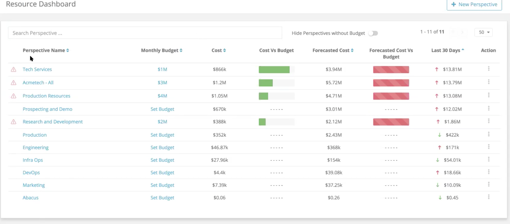
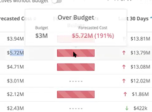
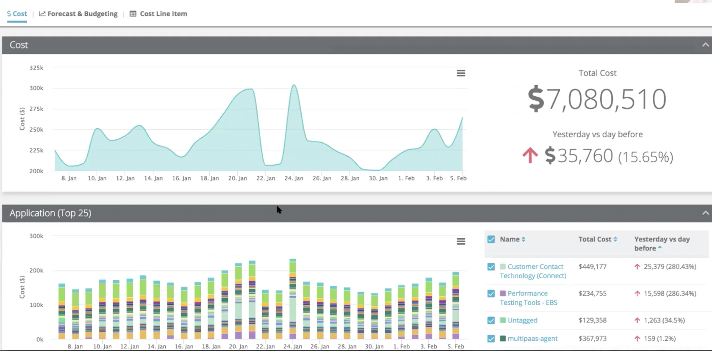
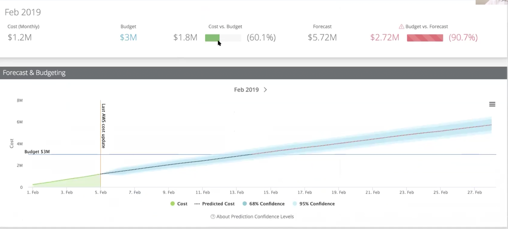
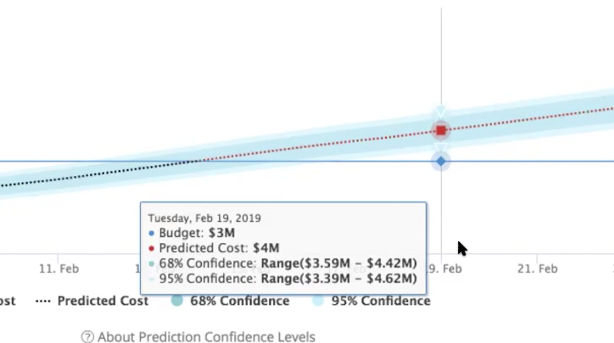

# Forecasting and Budgeting Quickstart

As an enhancement to Yotascale's CloudOps Reports, Forecasting and Budgeting provides you with the results of predictive modeling to indicate where your cloud service costs will be within your monthly allocated budget. 

## Resource Dashboard

The **Resource Dashboard** provides a quick overview of your costs, budget and forecasted costs. To get to the **Resource Dashboard**, click the **Analytics** button at the top of the **Cloud Operations Report** screen.

Once the **Resource Dashboard** loads, you are presented with tabular budget data for the **Perspectives** you established when configuring Yotascale for your organization. Each **Perspective** displays its *Monthly Budget*, *Cost*, *Cost Vs Budget*, *Forecasted Cost*, *Forecasted Cost vs Budget* and *Last 30 Days* (which indicates if costs are trending upward or downward).

### Forecasted Cost

Using **Yotascale**'s predictive modeling, a forecasted cost can now be presented. This analysis is an indicator of whether, by the end of the month being viewed, your cost will exceed allocated the budget for this **Perspective**. 

### Forecasted Cost vs Budget

Yotascale offers a visual indicator of whether your forecasted cost will exceed your allocated budget for this **Perspective**. Scroll over the **Forecasted Cost vs Budget** bar to see a popover detailing the forecasted cost versus budget analysis, including an over or under percentage. 

### Forecasted Cost Detailed Summmary

The **Forecated Cost Summary** provides you with both a cost summary analysis of your forcasted cost for the selected month versus your current budget, as well as a graph that charts the cost increases over time. 

Follow these steps to view the **Forecasted Cost Summary**

1. From the **Resource Dashboard** click the **Perspective** name. 
2. A screen loads that contains the historical cost for the **Perspective**
3. Click the **Forecasting and Budget** button. 

The **Forecasted Cost Summary** is displayed. This view provides you with a cost summary of the **Perspective** for the current month, which includes:

 - Cost
 - Budget
 - Cost vs Budget
 - Forecast (forecasted cost)
 - Budget vs Forecast

 Below this summary is a forecast graph, which shows, based on Yotascales's predictive analysis for your organization, whether your cost will increase or decrease, an incremental scale for that change, and a breakpoint indicating where the change will cross above or below your allocated budget.

 The graph line is centered on a blue background. Based on the statistical model used to forecast your costs, this background represents a forecast range and the **Prediction Confidence Level**, a percentage indicating Yotascale's confidence that your forecasted cost will fall within this range.

Hovering over the graph at any point will display a popover that provides more details about the **Prediction Confidence Level**, including the corresponding range for each forecasted confidence level. 

## Features and Benefits

**Forecast Cost For Your Teams**  
Forecast your cost for a given month or quarter for any **Perspective**. This can provide you with a granular analysis of future costs for any business unit or application or team. 

**Control Allocated Budgets**  
The **Resource Dashboard** enables you to keep your budget current and provides the base from which the predictive analysis will be made. 

**Track Cost Relative To Budget**  
The cost for monthly or quarterly time periods can be tracked and analyzed. 

**Proactive Notifications**  
Whenever costs exceed budget, a notification can be sent to inform you that you are currently exceeding your budget. 

